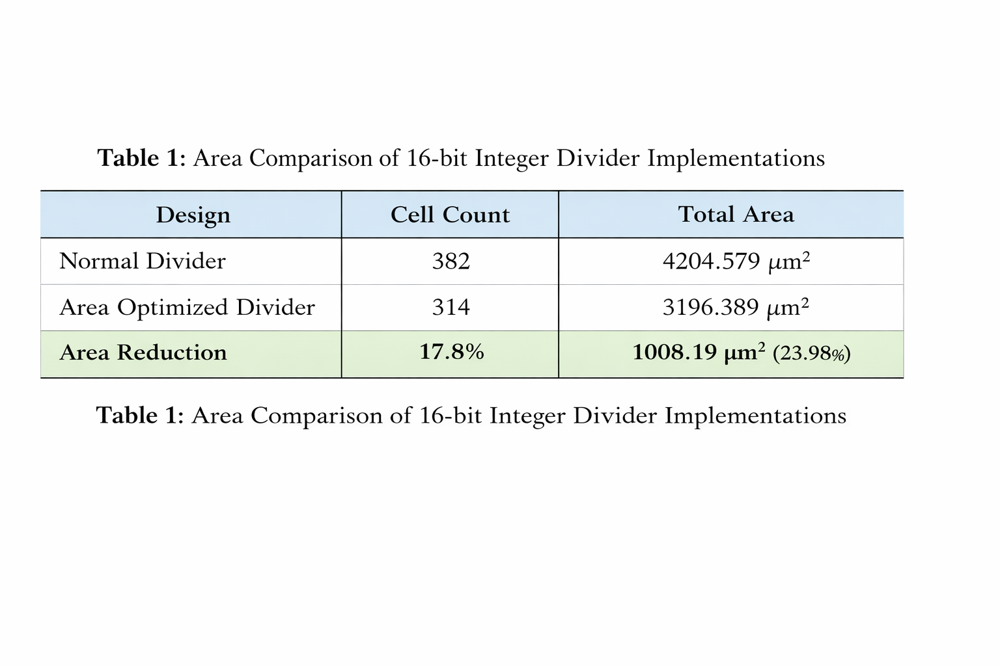
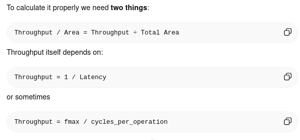

# **Silicon_Sprint_PS9**

## Objective

Design and analysis of a 16-bit
 integer divider with emphasis on minimizing hardware area and gate 
count. The project compares a normal combinational divider with an 
area-optimized sequential divider using synthesis results.

```
divider-area-optimization/
│
├── README.md
│
├── images/
│   ├── Flow
│   │     └── normal_divider_flow.png
│   │     └── optimized_divider_flow.png
│   ├── Waveforms
│   │     └── normal_divider1_wavewform.png
│   │     └── optimized_divider_wavewform.png
│
├── rtl/
│   ├── divider_normal.v
│   └── divider_optimized.v
│
├── tb/
│   ├── tb_divider_normal.sv
│   └── tb_divider_optimized.sv
│
├── synthesis/
│   └── synth.tcl
│
├── reports/
    ├── normal_area.rpt
    ├── normal_power.rpt
    ├── normal_timing.rpt
    ├── optimized_area.rpt
    ├── optimized_power.rpt
    └── optimized_timing.rpt
```

# Area comparision

## 1. Area Report for Normal Divider

The normal divider was synthesized using Cadence Genus under the **slow operating condition** using the standard cell library. The synthesis report shows that the design contains **382 standard cells** with a total cell area of **4204.579 µm²**.

The higher area is mainly due to the use of the built-in division (`/`) and modulus (`%`) operators in the RTL code. During synthesis, these operators are expanded into a large combinational divider circuit, which significantly increases the hardware utilization.

**Synthesis Result**

| Parameter | Value |
| --- | --- |
| Cell Count | 382 |
| Cell Area | 4204.579 |
| Net Area | 0 |
| Total Area | 4204.579 |

---

## 2 Area Report for Area-Optimized Divider

The optimized divider was designed using an **iterative restoring division algorithm**, which reuses hardware resources across multiple clock cycles instead of computing the entire division in a single combinational block.

The synthesis report shows that the design contains **314 standard cells** with a total cell area of **3196.389 µm²**.

The reduction in hardware is achieved by:

- Using shift operations
- Using a single subtractor
- Reusing registers across multiple clock cycles

This approach significantly reduces the required combinational logic.

**Synthesis Result**

| Parameter | Value |
| --- | --- |
| Cell Count | 314 |
| Cell Area | 3196.389 |
| Net Area | 0 |
| Total Area | 3196.389 |

---

## 3 Area Comparison

| Design | Cell Count | Total Area |
| --- | --- | --- |
| Normal Divider | 382 | 4204.579 |
| Area Optimized Divider | 314 | 3196.389 |

---

## Area Reduction Calculation

Area saved:

```
4204.579 − 3196.389 = 1008.19
```

Percentage reduction:

```
(1008.19 / 4204.579) × 100 ≈ 23.98%
```

---
<p align="center"></p>

---

## Throughput per Area Efficiency Analysis

Throughput per Area Efficiency evaluates how efficiently a design uses silicon area to deliver computational performance. It combines the **operating frequency, latency, and silicon area** into a single metric.

<p align="center"></p>

---

## 1 Maximum Operating Frequency

From the timing reports:

### Normal Divider

Data path delay
<p align="center"></p>

---

### Area Optimized Divider

Data path delay

<p align="center"></p>

---

## 2 Latency

| Design | Cycles per Division |
| --- | --- |
| Normal Divider | 1 cycle |
| Optimized Divider | 16 cycles |

---

## 3 Throughput Calculation

### Normal Divider

```
Throughput = 3.26 GHz / 1
```

```
Throughput ≈ 3.26 × 10^9 operations/sec
```

---

### Optimized Divider

```
Throughput = 206 MHz / 16
```

```
Throughput ≈ 12.9 × 10^6 operations/sec
```

---

## 4 Throughput per Area

| Design | Throughput | Area | Throughput / Area |
| --- | --- | --- | --- |
| Normal Divider | 3.26 × 10⁹ ops/s | 4204.579 | **7.75 × 10⁵** |
| Optimized Divider | 1.29 × 10⁷ ops/s | 3196.389 | **4.03 × 10³** |

---

## 5 Observation

The normal divider achieves significantly higher throughput because the entire division operation is performed in a single cycle using combinational logic. However, this approach requires larger hardware resources.

The area-optimized divider reduces silicon area by approximately **24%**, but requires multiple clock cycles to complete the division. As a result, its throughput is lower.

## Conclusion
This project implemented and analyzed two architectures for a 16-bit integer divider: a normal combinational divider and an area-optimized sequential divider. Both designs were verified through simulation and synthesized using Cadence Genus to evaluate their hardware characteristics.

The synthesis results show that the optimized divider reduces the total silicon area from 4204.579 µm² to 3196.389 µm², achieving an area reduction of approximately 24%. This improvement is obtained by using an iterative shift-subtract algorithm that reuses hardware resources across multiple clock cycles.

Although the combinational divider provides higher throughput due to its single-cycle operation, it requires significantly more hardware. The optimized divider demonstrates that trading performance for hardware reuse can effectively reduce silicon area, making it suitable for area-constrained digital systems.
